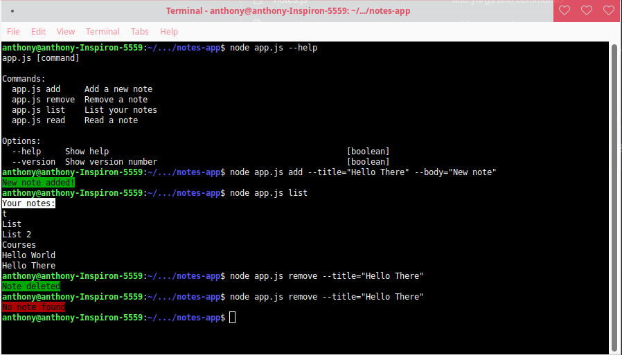

# Node.js

## Project: Notes App

This is a small note taking app using the command line. It was built using node.js in order to practice my skills creating an app and installing packages using the Node Package Manager. 

### Outcome of this project:

- Deepened knowledge of Node JS
- Build a command line tool using Yargs
- Installing and using NPM Packages

### Preview of the App:

